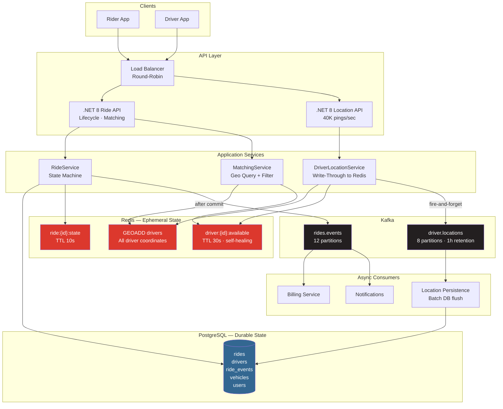

# Ride Sharing System

A distributed ride-hailing backend built with .NET 8 using Redis geospatial indexing for real-time driver matching, PostgreSQL for durable ride state, and Kafka for event-driven lifecycle propagation. Demonstrates the dual-store architecture pattern where Redis and PostgreSQL serve fundamentally different access patterns.

---

## Quick Start

```bash
git clone <repo>
cd ride-sharing-system
cp .env.example .env
docker compose up --build
```

- **API:** http://localhost:8081
- **Swagger UI:** http://localhost:8081/swagger
- **Health:** http://localhost:8081/health

---

## Architecture



---

## Why I Built This

The ride-sharing system demonstrates a dual-store architecture that is a common interview topic. Real-time matching has requirements that are fundamentally incompatible with a relational database: 200,000 drivers each pinging their location every 5 seconds is 40,000 writes per second — all overwriting previous values, all ephemeral (a location older than 30 seconds is irrelevant). PostgreSQL would be crushed. Redis GEOADD handles it trivially. But ride lifecycle state (state transitions, fare calculation, payment triggers) needs ACID transactions, foreign key integrity, and a permanent audit trail — exactly what Redis cannot provide. The two stores serve different masters.

---

## Key Design Decisions

**1. Redis geo-index is the primary matching store, not a cache.** There is no PostgreSQL query behind the geo-index. Redis is the source of truth for real-time location. Driver coordinates in the `drivers` table are updated asynchronously via Kafka — they are for analytics, not matching.

**2. Availability via TTL, not explicit state.** A driver who stops pinging does not need a separate "mark unavailable" call. Their `driver:{id}:available` key expires after 30 seconds automatically. This makes the system self-healing: a crashed driver app causes no stale data beyond one TTL window.

**3. Location persistence is off the hot path.** PATCH /drivers/{id}/location writes to Redis (fast) and publishes to Kafka (fire-and-forget). The Kafka consumer batch-flushes to PostgreSQL every 5 seconds. The hot path never blocks on a database write.

**4. Lock ordering on ride acceptance.** When a driver accepts a ride, the availability flag is cleared atomically before the database update. If two riders' requests both match to the same driver simultaneously, only one can clear the flag — the second sees it already gone and receives a 409 Conflict.

**5. Haversine fare calculation.** Fare is calculated from the great-circle distance between pickup and dropoff coordinates using the Haversine formula. This gives ~0.5% accuracy for urban distances — sufficient for display and billing.

---

## What I Would Improve

- **Surge pricing model:** incorporate supply/demand ratio into fare calculation using real-time driver density from the geo-index.
- **Matching timeout queue:** rides that fail to match within 10 minutes should be placed in a priority queue for manual dispatch, not silently cancelled.
- **Driver ETA via road network:** the current ETA is based on straight-line distance at a fixed assumed speed. A routing engine (OSRM, GraphHopper) would give accurate road-network ETAs.

---

---

## Running the System

```bash
docker compose up --build
```

### Demo Operations

**1. Register a driver and go online** (set availability + location)

```bash
curl -s -X PATCH http://localhost:8081/api/v1/drivers/drv_001/location \
  -H "Content-Type: application/json" \
  -H "Authorization: Bearer dev-token" \
  -d '{"latitude": -26.2041, "longitude": 28.0473}' | jq .
```

**2. Find nearby drivers**

```bash
curl -s "http://localhost:8081/api/v1/drivers/nearby?lat=-26.2041&lng=28.0473&radius=5" | jq .
```

**3. Request a ride**

```bash
curl -s -X POST http://localhost:8081/api/v1/rides/request \
  -H "Content-Type: application/json" \
  -H "Authorization: Bearer dev-token" \
  -d '{
    "pickup_lat": -26.2041, "pickup_lng": 28.0473,
    "dropoff_lat": -26.1929, "dropoff_lng": 28.0305
  }' | jq .
```

**4. Accept the ride (as driver)**

```bash
RIDE_ID="ride_xxx"
curl -s -X POST http://localhost:8081/api/v1/rides/$RIDE_ID/accept \
  -H "Authorization: Bearer driver-token" | jq .
```

**5. Progress the ride**

```bash
curl -s -X POST http://localhost:8081/api/v1/rides/$RIDE_ID/start | jq .
curl -s -X POST http://localhost:8081/api/v1/rides/$RIDE_ID/complete | jq .
# Response includes calculated fare
```

**6. Observe geo-index TTL:** Stop sending location pings for 30 seconds, then call nearby drivers — the driver disappears from results automatically.
