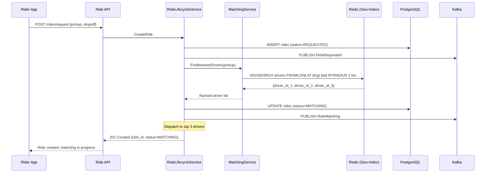
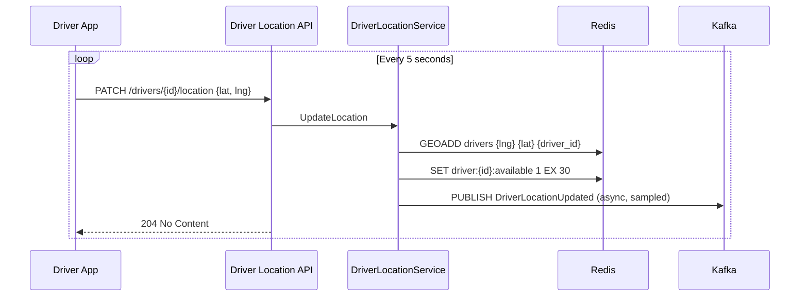
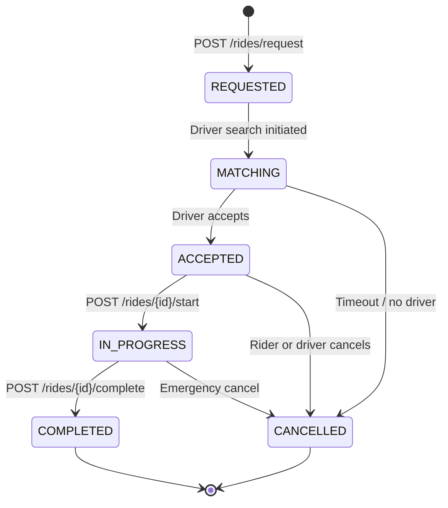

# Requirements — Ride Sharing System

---

## Functional Requirements

**FR-01** — The system shall allow a rider to submit a ride request with pickup and dropoff
coordinates and receive either a matched driver or a no-driver-available response.

**FR-02** — The system shall search for available drivers within a configurable radius
(default: 2km) of the pickup coordinates and expand to 5km if no drivers are found.

**FR-03** — The system shall dispatch a ride request to the nearest available driver(s),
ranked by distance, and wait for an acceptance or timeout.

**FR-04** — A driver shall be able to accept or decline a ride request. The first driver
to accept claims the ride; all other notified drivers receive a cancellation signal.

**FR-05** — The system shall enforce that no driver is assigned to more than one active
ride at any given time.

**FR-06** — The system shall manage the ride lifecycle through the following states:
REQUESTED → MATCHING → ACCEPTED → IN_PROGRESS → COMPLETED or CANCELLED.

**FR-07** — The system shall reject any state transition that is not valid from the current
ride state, returning a clear error to the caller.

**FR-08** — A driver app shall be able to publish its current location (latitude, longitude)
to the system at regular intervals (every 5 seconds).

**FR-09** — A driver shall be able to toggle their availability status between AVAILABLE
and OFFLINE.

**FR-10** — The system shall automatically remove a driver from the available pool if no
location ping is received within 30 seconds.

**FR-11** — The system shall publish a `RideStateChanged` event to the event stream for
every ride lifecycle transition.

**FR-12** — The API must return the current state and details of any ride by ride ID.

---

## Non-Functional Requirements

### Availability
- **NFR-01** — The system shall maintain 99.9% uptime.
- **NFR-02** — Redis geo-index loss must self-heal within 30 seconds through driver
  location republications without operator intervention.

### Latency
- **NFR-03** — Ride match response time (request received to driver identified) p95 ≤ 2,000ms.
- **NFR-04** — `PATCH /drivers/{id}/location` p99 ≤ 50ms (location ping must not lag the driver app).
- **NFR-05** — Ride state transition API p99 ≤ 300ms.

### Throughput
- **NFR-06** — The system shall support 10,000 concurrent active rides.
- **NFR-07** — The system shall track 200,000 active driver locations simultaneously.
- **NFR-08** — The system shall handle 40,000 driver location pings per second at peak
  (200,000 drivers × 1 ping/5s).

### Consistency
- **NFR-09** — Ride state transitions are strongly consistent — a read immediately after a
  transition must reflect the new state.
- **NFR-10** — Driver location data in the geo-index may be up to 5 seconds stale (one ping
  interval) under normal operation. This is acceptable for matching purposes.

### Durability
- **NFR-11** — Every ride state transition shall be durably persisted in PostgreSQL before
  the state transition API returns success.
- **NFR-12** — Driver location data in Redis is ephemeral. Loss of location data does not
  constitute data loss — it is recovered automatically through driver republications.

---

## Estimated Traffic

| Metric                              | Estimate                    |
|-------------------------------------|-----------------------------|
| Registered users (riders)           | 1,000,000                   |
| Registered drivers                  | 200,000                     |
| Concurrent active rides             | 10,000                      |
| Driver location pings/second        | 40,000                      |
| Ride requests/day                   | 500,000                     |
| Peak ride request rate              | 500 requests/second         |
| Ride events published/day (Kafka)   | ~2,500,000 (5 per ride avg) |
| Average ride duration               | 20 minutes                  |

---

## Data Flow

### Ride Request — Happy Path

### Driver Location Update

### Ride State Transition Flow

